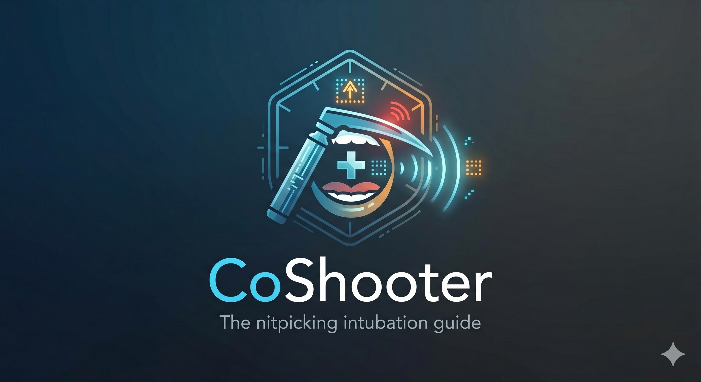

# CoShooter

CoShooter is a "nitpicking" biofeedback device for neonatal intubation training using micro:bit. It provides relentless real-time feedback to nip any "levering" (prying) habits in the bud.

CoShooterは、micro:bitを利用した「小うるさい（nitpicking）」バイオフィードバックデバイスです。手技中の「こじ上げ」をリアルタイムで指摘して、悪い癖を根本から矯正します。

---

## ⚠️ Disclaimer / 免責事項

**[English]**
This device and software are for **educational simulation and training purposes only**. They are NOT intended for clinical use on human patients. The developer (Kota Yoneda) assumes no responsibility for any consequences, damages, or injuries resulting from the use of this software or device. Use at your own risk.

**[日本語]**
本デバイスおよびソフトウェアは、**教育用のシミュレーションおよびトレーニング専用**です。実際の患者に対する臨床使用（医療行為）を目的としたものではありません。本ソフトウェアまたはデバイスの使用によって生じたいかなる結果、損害、負傷についても、開発者（Kota Yoneda）は一切の責任を負いません。利用者の責任において使用してください。

---

## Features / 特徴

* **Geiger Counter Style Feedback**: As the tilt angle increases, the alert sound becomes higher in pitch and faster in frequency.
* **Dual Feedback**: Visual (LED icons) and auditory (piezo buzzer) alerts.
* **Customizable Thresholds**: Easily adjust "Safe" and "Danger" angles in the code to match your clinical criteria.

* **ガイガーカウンター方式**: 角度が深くなるにつれて、警告音が「高く」「速く」なり、直感的な把握が可能です。
* **二重のフィードバック**: LEDアイコン（✅/❌）と圧電スピーカーによる音で警告します。
* **カスタマイズ可能**: 臨床基準に合わせて、プログラム上の「安全限界」と「危険限界」の角度を簡単に変更できます。

---

## Project Structure / プロジェクト構成

* `main.py`: The core program for micro:bit.
* `LICENSE`: MIT License (Copyright (c) 2026 Kota Yoneda).
* `docs/`: 
    * [assembly.md](docs/assembly.md): How to mount it on a laryngoscope.
    * [usage.md](docs/usage.md): How to operate and interpret sounds.
    * [customization.md](docs/customization.md): How to change thresholds.
    * [flashing_guide.md](docs/flashing_guide.md): How to flash the code to micro:bit.
* `assets/`: Logos and demonstration media.

---

## Getting Started / はじめかた

### English
1.  **Preparation**: Prepare a micro:bit and a battery pack.
2.  **Flash**: Follow the [Flashing Guide](docs/flashing_guide.md) to upload `main.py`.
3.  **Assemble**: Follow the [Assembly Guide](docs/assembly.md) to mount it on your laryngoscope handle.
4.  **Train**: Turn it on (A+B buttons) and start your simulation!

---

### 日本語
1.  **準備**: micro:bitと電池ボックスを用意します。
2.  **書き込み**: [Flashing Guide](docs/flashing_guide.md) に従って `main.py` を書き込みます。
3.  **組み立て**: [Assembly Guide](docs/assembly.md) を参考にハンドルへ固定します。
4.  **練習**: A+Bボタンで起動し、トレーニングを開始してください。

---

## License / ライセンス

This project is licensed under the **MIT License**. See the [LICENSE](LICENSE) file for details.

Developed by **Kota Yoneda**
Assistant Professor, Department of Pediatrics, Teikyo University Hospital.
